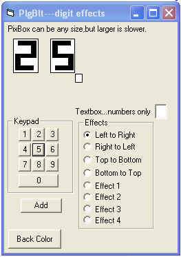



## PlgBlt\_Digits Effects Demo

### Description

I was playing around with Plgblt and came up with some interesting effects for an idea on counters.See what you think.You can use your own graphics,digits can be resized easily.This is only a demo, not a completed project.That is up to you.Updated: added some more effects.
 
### More Info
 

             |
---                |---
**Submitted On**   |2009-04-24 17:55:46
**By**             |[Kenneth Foster](https://github.com/Planet-Source-Code/PSCIndex/blob/master/ByAuthor/kenneth-foster.md)
**Level**          |Beginner
**User Rating**    |5.0 (10 globes from 2 users)
**Compatibility**  |VB 6\.0
**Category**       |[Graphics](https://github.com/Planet-Source-Code/PSCIndex/blob/master/ByCategory/graphics__1-46.md)
**World**          |[Visual Basic](https://github.com/Planet-Source-Code/PSCIndex/blob/master/ByWorld/visual-basic.md)
**Archive File**   |[PlgBlt\_Dig2150634242009\.zip](https://github.com/Planet-Source-Code/kenneth-foster-plgblt-digits-effects-demo__1-72015/archive/master.zip)

